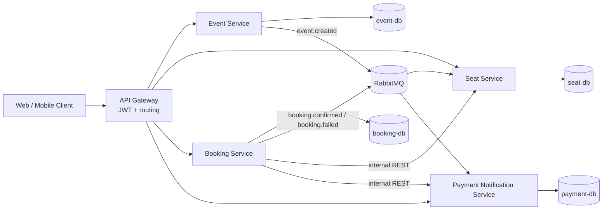

# Smart Event Ticketing and Reservation Platform

A Spring Boot microservices project for a global event ticketing platform. The system is intentionally designed around the assignment constraints: four independently deployable services, real inter-service communication, Docker, CI/CD, OpenAPI, cloud deployment readiness, and basic security/DevSecOps support.

## Services

- **API Gateway** - external entry point, JWT issuance and request propagation
- **Event Service** - event and venue schedule management
- **Seat Service** - seat inventory, temporary reservation, booking confirmation, expiry handling
- **Booking Service** - booking orchestration and ticket creation
- **Payment Notification Service** - payment (built-in simulator or **Stripe test mode**) and booking notifications (audit log plus optional **SendGrid** email and **Twilio** SMS); see `docs/INTEGRATIONS.md`

## Why this project justifies microservices

- Event creation and catalog browsing have a very different lifecycle from seat locking.
- Seat inventory needs isolated transactional logic and timed lock expiry.
- Booking orchestration coordinates multiple services and can scale independently.
- Payment processing and notification delivery have a different failure model and security boundary.

## Architecture



## Main flow

1. Admin logs in through the gateway and creates an event.
2. Event Service publishes `event.created`.
3. Seat Service consumes the event and generates a seat map.
4. Customer logs in and creates a booking request.
5. Booking Service reserves seats through Seat Service.
6. Booking Service processes payment through Payment Notification Service.
7. Booking Service confirms or releases seats.
8. Booking Service publishes `booking.confirmed` or `booking.failed`.
9. Payment Notification Service consumes the event and writes notification logs.

## Local run

### 1. Start the platform

```bash
docker compose up --build
```

### 2. Log in as admin

```bash
curl -X POST http://localhost:8080/auth/login \
  -H 'Content-Type: application/json' \
  -d '{"username":"admin","password":"admin123"}'
```

### 3. Create an event

```bash
curl -X POST http://localhost:8080/api/events \
  -H 'Authorization: Bearer <ADMIN_TOKEN>' \
  -H 'Content-Type: application/json' \
  -d '{
    "title":"Colombo Music Fest",
    "description":"Live global music night",
    "venue":"BMICH",
    "startsAt":"2026-06-12T18:30:00Z",
    "endsAt":"2026-06-12T22:00:00Z",
    "totalRows":8,
    "seatsPerRow":10,
    "vipRows":2,
    "vipPrice":120.00,
    "regularPrice":60.00
  }'
```

### 4. View the generated seats

```bash
curl http://localhost:8080/api/seats/events/1
```

### 5. Log in as a customer and create a booking

```bash
curl -X POST http://localhost:8080/auth/login \
  -H 'Content-Type: application/json' \
  -d '{"username":"customer","password":"customer123"}'
```

```bash
curl -X POST http://localhost:8080/api/bookings \
  -H 'Authorization: Bearer <CUSTOMER_TOKEN>' \
  -H 'Content-Type: application/json' \
  -d '{
    "eventId":1,
    "seatNumbers":["A1","A2"],
    "paymentMethod":"CARD",
    "cardToken":"4242424242424242"
  }'
```

The gateway puts each demo user’s **phone** (E.164) on the booking from the JWT as **`X-User-Phone`** — used for **Twilio SMS** when Twilio env vars are set (see `docs/INTEGRATIONS.md`). **Log in again** after upgrading so tokens include the `phone` claim.

With the **simulator** (no `STRIPE_SECRET_KEY`), a `cardToken` ending in `0000` or the literal `FAIL` simulates decline. With **Stripe** enabled, the same tokens map to a Stripe decline test card; otherwise use Stripe test cards or a `pm_…` id.

## Default demo users

| Username | Password | Role | Phone (E.164) |
|---|---|---|---|
| admin | admin123 | ADMIN | +15555550101 |
| customer | customer123 | CUSTOMER | +15555550102 |
| user2 | user2123 | CUSTOMER | +15555550103 |

## Swagger / OpenAPI

Each microservice exposes its own OpenAPI docs.

- Gateway: `http://localhost:8080/swagger-ui.html`
- Event Service: `http://localhost:8081/swagger-ui.html`
- Seat Service: `http://localhost:8082/swagger-ui.html`
- Booking Service: `http://localhost:8083/swagger-ui.html`
- Payment Notification Service: `http://localhost:8084/swagger-ui.html`

## Security highlights

- JWT-based authentication at the gateway
- Gateway injects trusted user headers to downstream services
- Internal service-to-service APIs protected with `X-Internal-Token`
- Public and private routes separated by purpose
- Containers can be deployed with only the gateway publicly exposed

## DevOps / DevSecOps

- Multi-stage Dockerfiles for every service
- Docker Compose for local orchestration
- GitHub Actions CI workflow
- GHCR publish workflow template
- SonarCloud configuration placeholder
- Snyk-friendly structure and dependency separation

## Optional integrations (Stripe, SendGrid, Twilio)

Configure environment variables on **payment-notification-service** (see `docker-compose.yml`). Full checklist, Postman flow, and Azure deployment notes: **[docs/INTEGRATIONS.md](docs/INTEGRATIONS.md)**.

## Repository map

- `docs/ARCHITECTURE.md` - architecture and sequence diagrams
- `docs/INTEGRATIONS.md` - Stripe, SendGrid, Twilio env vars, Postman testing, deployment
- `docs/CODE_PLAN.md` - implementation plan and service breakdown
- `docs/DEPLOYMENT.md` - Azure Container Apps deployment approach
- `.github/workflows/` - CI/CD pipeline templates
- `docker-compose.yml` - local environment
