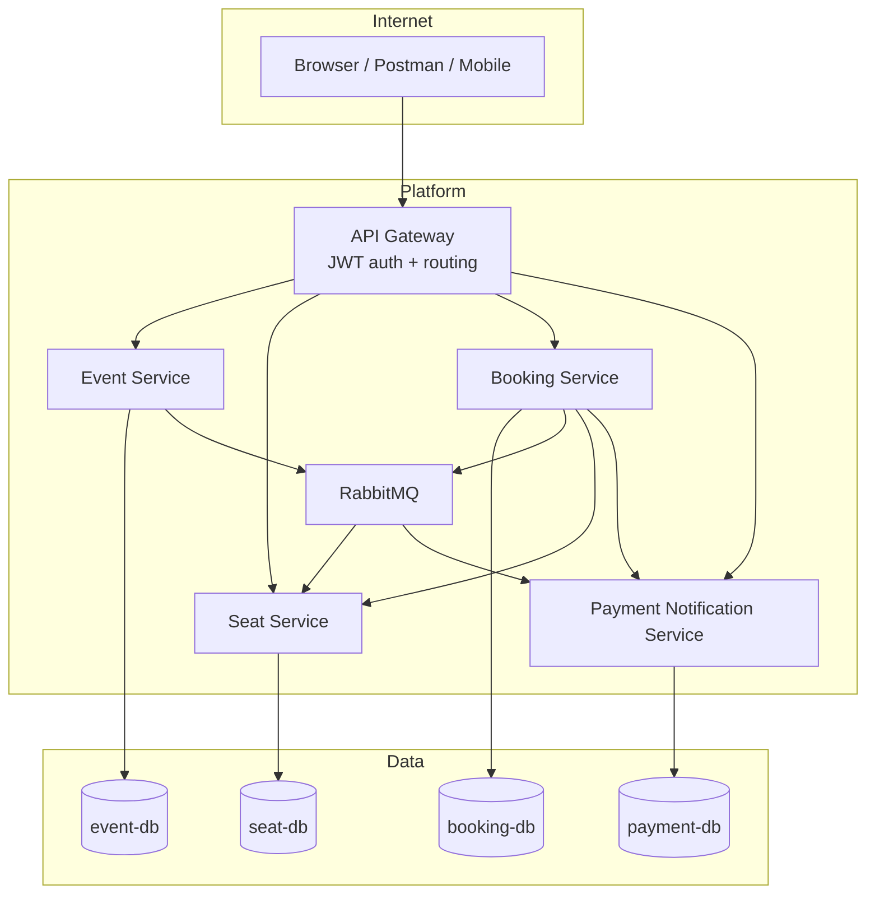
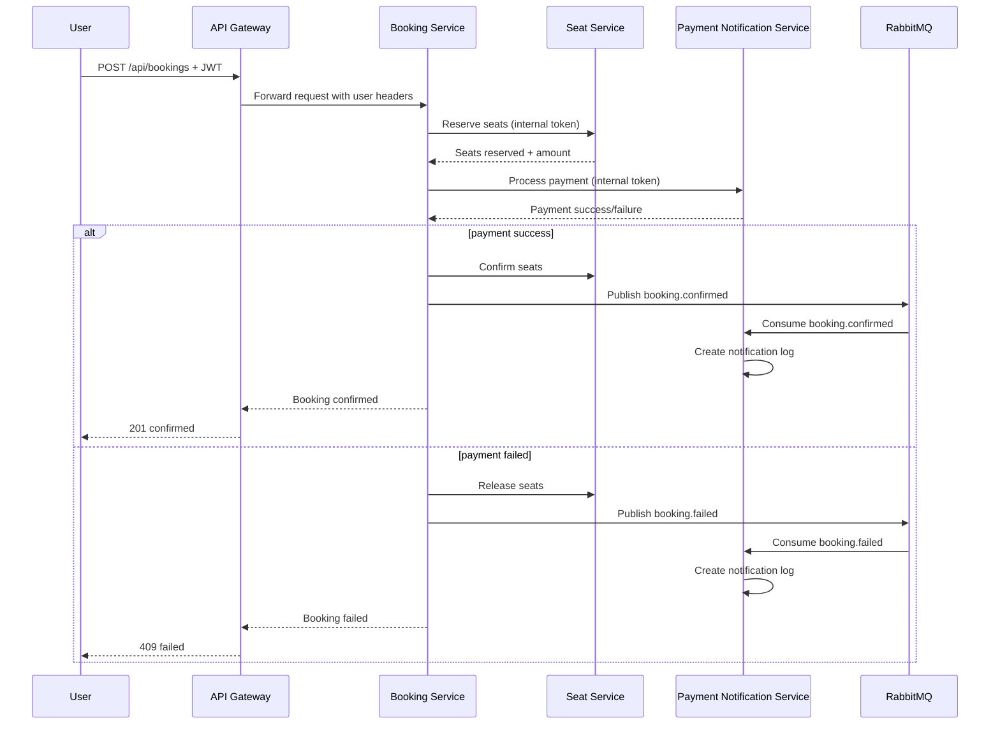
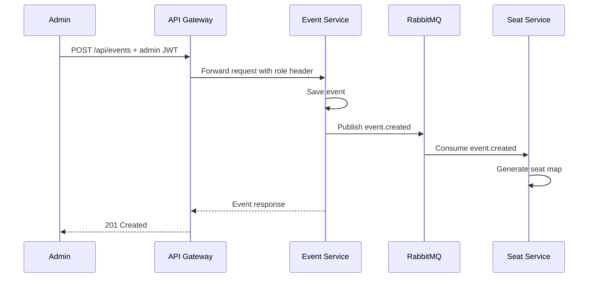
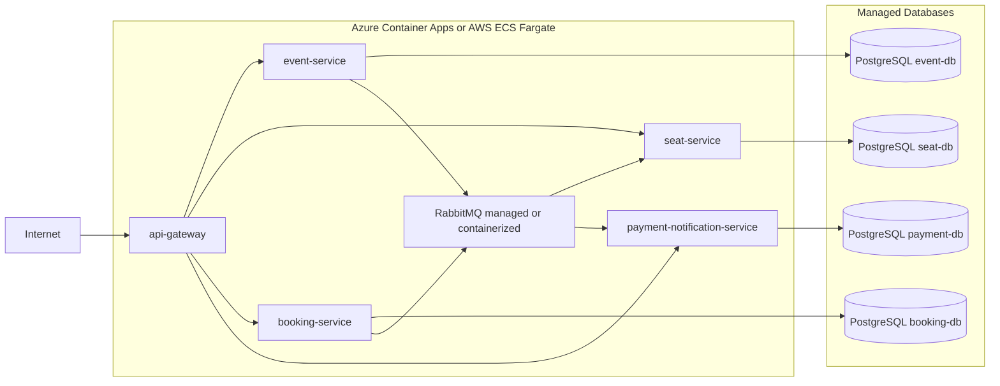

# Architecture

## High-level component diagram

```mermaid
flowchart TB
    subgraph Internet
        client[Browser / Postman / Mobile]
    end

    subgraph Platform
        gateway[API Gateway\nJWT auth + routing]
        rabbit[RabbitMQ]
        event[Event Service]
        seat[Seat Service]
        booking[Booking Service]
        payment[Payment Notification Service]
    end

    subgraph Data
        edb[(event-db)]
        sdb[(seat-db)]
        bdb[(booking-db)]
        pdb[(payment-db)]
    end

    client --> gateway
    gateway --> event
    gateway --> seat
    gateway --> booking
    gateway --> payment

    event --> edb
    seat --> sdb
    booking --> bdb
    payment --> pdb

    event --> rabbit
    rabbit --> seat
    booking --> rabbit
    rabbit --> payment

    booking --> seat
    booking --> payment
```

## Booking sequence

```mermaid
sequenceDiagram
    participant U as User
    participant G as API Gateway
    participant B as Booking Service
    participant S as Seat Service
    participant P as Payment Notification Service
    participant MQ as RabbitMQ

    U->>G: POST /api/bookings + JWT
    G->>B: Forward request with user headers
    B->>S: Reserve seats (internal token)
    S-->>B: Seats reserved + amount
    B->>P: Process payment (internal token)
    P-->>B: Payment success/failure

    alt payment success
        B->>S: Confirm seats
        B->>MQ: Publish booking.confirmed
        MQ->>P: Consume booking.confirmed
        P->>P: Create notification log
        B-->>G: Booking confirmed
        G-->>U: 201 confirmed
    else payment failed
        B->>S: Release seats
        B->>MQ: Publish booking.failed
        MQ->>P: Consume booking.failed
        P->>P: Create notification log
        B-->>G: Booking failed
        G-->>U: 409 failed
    end
```

## Event creation sequence

```mermaid
sequenceDiagram
    participant A as Admin
    participant G as API Gateway
    participant E as Event Service
    participant MQ as RabbitMQ
    participant S as Seat Service

    A->>G: POST /api/events + admin JWT
    G->>E: Forward request with role header
    E->>E: Save event
    E->>MQ: Publish event.created
    MQ->>S: Consume event.created
    S->>S: Generate seat map
    E-->>G: Event response
    G-->>A: 201 Created
```

## Deployment view

```mermaid
flowchart LR
    subgraph Azure Container Apps or AWS ECS Fargate
        gateway[api-gateway]
        event[event-service]
        seat[seat-service]
        booking[booking-service]
        payment[payment-notification-service]
        rabbit[RabbitMQ managed or containerized]
    end

    subgraph Managed Databases
        edb[(PostgreSQL event-db)]
        sdb[(PostgreSQL seat-db)]
        bdb[(PostgreSQL booking-db)]
        pdb[(PostgreSQL payment-db)]
    end

    Internet --> gateway
    gateway --> event
    gateway --> seat
    gateway --> booking
    gateway --> payment
    event --> edb
    seat --> sdb
    booking --> bdb
    payment --> pdb
    event --> rabbit
    booking --> rabbit
    rabbit --> seat
    rabbit --> payment
```
